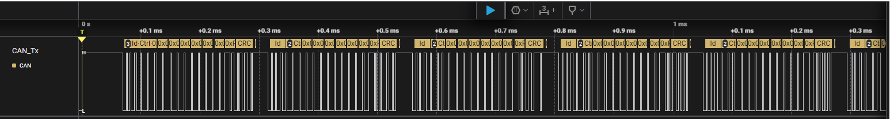
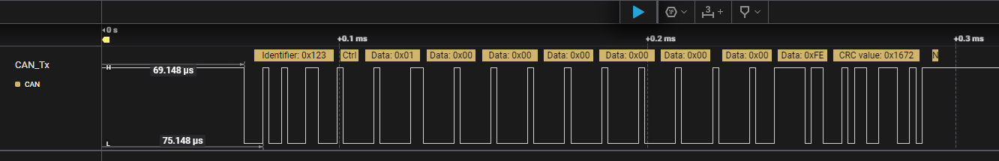

# bxCAN in Loopback mode on several STM32 platforms

## Summary

The purpose of this example is to provide the bxCAN configuration in Loop Back mode in different platforms.

## Hardware

This example is provided for the following platforms and can be tailored for any other STM32 platform, provided the MCU features an FDCAN interface:
* NUCLEO-F103RE (STM32F103RE)
* NUCLEO-F207ZG (STM32F207ZG)
* NUCLEO-F302R8 (STM32F302R8)
* NUCLEO-F439ZI (STM32F439ZI)
* NUCLEO-F767ZI (STM32F767ZI)

The example can be tailored to any MCU featuring CAN interface.

## How to use this example

1. Build the project corresponding to your STM32 board, then load the generated image into memory. 
2. After compiling the project and staring the debug, you can add the TxData and RxData to the “Live Expressions” to check how they will be updated during the application running.
3. If you have a logic analyzer featuring a CAN analyzer you can probe the transmitted CAN frames on CAN_Tx pin.

## Frames captured by Saleae Logic analyzer on NUCLEO-F103RE

Zoom out of a capture on the CAN_Tx pin:

Zoom in of a capture on the CAN_Tx pin, the first frame sent by the application: 

The pulses related to the zeroed data are stuffed bits that correspond to the the bit stuffing mechanism.

## Additional resources

Please refer to [this](NOT YET DEFINED) article for the timing configuration and the hardware setup to correctly run this example on a specific platform.

## Questions & Feedback

Please refer to the [CONTRIBUTING.md](CONTRIBUTING.md) guide.
